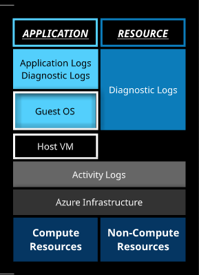
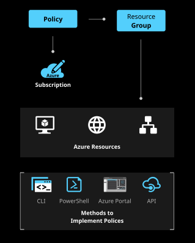

# Manage Azure Subscriptions and Resources
## Manage Azure Subscriptions
### Configuring Azure Subscription Policies at the Azure Subscription Level
- Azure Policy is a service for *creating, assigning, and managing policies.*
  - These policies enforce different rules over your resources to ensure resource meet corporate standards and SLAs.
  - Azure Policy does this by running evaluations of your resources and scanning for those not compliant
- Implementing Azure Policy
  - A policy definition express what to evaluate and actions
  - Initiative definition is a set of policy definitions to help track your compliance state for a larger goal
  - You can limit the scope to management groups, subscriptions, or resource groups
  - Once the initiative definition is assigned, you can evaluate the state of compliance for all of your resources

## Analyze Resource Utilization and Consumption
### Creating Action Groups
- Enable you to configure a list of actions to take when the alert is triggered
- Ensures the same actions are taken each time an alert is triggered
- Action types
  - Select Email/SMS/Push/Voice
    - Provides the ability to send email, SMS, push notifications, or a voice call
  - Log App, Webhook, IT Service Management, Function
    - Run a Logic App
    - Deploy a Webhook
    - Integrate with an IT management service
    - Run a function app
  - Automation Runbook
    - Run an Azure Automation runbook

### Configuring Diagnostic Settings on Resources
- Azure Monitor
  - Enables *core monitoring* for Azure services by collecting metrics, activity logs, and diagnostic logs
  - Key capabilities of Azure Monitor include:
    - Monitor and visualize metrics
      - Numerical values available from Azure resources that help you understand health and performance
    - Query and analyze logs
      - Activity logs, diagnostic logs, and telemetry are monitoring solutions which can provide useful information
    - Setup alerts and actions
      - Notify you of critical conditions and can take automated corrective actions
      - Triggers for alerts can be based on metrics or logs
- Azure Monitor Diagnostic Logs
  - Logs provided by the Azure service that give useful data about the operation of Azure resources and services
  - Logs are constantly updating in real time to provide an accurate assessment of what is going on in the infrastructure
  - Two types of diagnostic logs
    - Tenant logs contain activity that occurs at the tenant level but is outside of the Azure subscription
    - Resource logs contain information from Azure services which deploy resources in Azure
    - 

### Creating and Resting Alerts
- Azure Monitor alerts can be configured to *notify you* when your resources are performing at a predetermined level or if an event has occurred
  - Benefits of Azure Monitor Alerts
    - Better notification
      - All new alerts use action groups
    - Unified experience
      - Alert metrics and logs are in one place
    - View alerts in Portal
    - Separation of Fired Alerts and Rules
      - Alert rules and fired alerts are differentiated, keeping operational and configuration views separate
- Create Alert rules
  - Define the alert condition including the following elements
    - Target selection(ie storage account)
    - Alert criteria (ie used capacity)
    - Alert logic (An action is triggered once the disk space capacity has grown past a size)
  - Define the alert details
    - Alert rules name
    - Description
    - Severity (range of 0 to 4)
  - Defining the action group
    - Notify you or your team
    - Take automated actions using webhooks and runbooks

### Analyzing Alerts/Metrics Across Subscriptions
- Azure Metrics
  - Provide details about your Azure Resource at a specific time or over a specified range
  - Information is collected on a regular basis and has built-in alert options
  - Example use cases
    - Analyze
      - Metrics Explorer is used to gather information from different resources
    - Visualize
      - Chart generation and workbooks which combines data
    - Alert
      - Notify people for specific events/triggers
    - Automate
      - Automatic scaling based on metric values
    - Retrieve
      - Can be retrieved using PowerShell, Rest API, and CLI
    - Export
      - Data can be sent to logs for analysis, Azure Event Hubs, or routed to an external system
    - Archive
      - Metrics can be kept for 93 days
      - Diagnostic logs can be routed to Log Analytics and configured to have a minimum retention of 30 days
      - Activity log entries are stored for 90 days
  - Improvements
    - Improved latency
      - New metric alerts can run as frequently as a minute.
    - Support for multi-dimensional metrics
      - You can set an alert on dimensional metrics to monitor an interesting segment of the metric
    - More control over metric conditions
    - Combined monitoring of multiple metrics
      - Combine multiple metrics with a single rule
    - Metrics from logs
      - You can extract some data going into Log Analytics and convert it to Azure Metrics
  - Signals are emitted by the target resource and can Azure Metrics, Activity Log, and Application Insights

### Creating a Baseline for Resources
- Once a baseline has been determined, you can use Metric Alerts with Dynamic thresholds to monitor your resource performance
  - Metric Alerts with Dynamic Thresholds use machine learning to analyze historic data in order to give suggestions regarding possible service issues.
  - Reasons to use dynamic type
    - Scalable alerting
      - Useful when handling multiple resources across multiple subscriptions
    - Smart metric pattern recognition
      - Identify patterns, causing the alerting to adapt and deviate as necessary
    - Intuitive configuration

### Monitoring for Unused Resources
- Azure Advisor
  - Helps you follow best practices to optimize your Azure deployments
  - Useful for tracking under-utilized resources
  - Reviews resource configuration and usage telemetry to provide advice on how to improve expenses, efficiency, performance, availability, and security of your Azure resources
  - Recommendations are divided into the following 4 categories
    - Availability
    - Security
    - Costs
    - Performance

### Monitoring Spending/Report on Spending
- Azure provides a set of Billing Rest API's that give access to resource consumption and metadata information for Azure subscriptions
  - Pricing Calculator
    - Estimates in all areas of Azure
  - Billing Alert Service
    - Create alerts to send when approaching spending limits
  - Cost Analysis
    - Useful for exploring and analyzing your organization's costs
  - Customize cost views
    - 4 built-in views
      1. Accumulated costs
      2. Daily costs
      3. Cost by service
      4. Cost by resource
  - Download Reports
  - Cost Analysis Prerequisites
   - Read access to billing account, department, enrollment account, management group, subscription, or resource group

### Utilizing Log Search Query Functions
- Log Analytics
  - Helps you collect, correlate, search, and act on log and performance data generated by operating systems and applications
  - Most interactions will be through the OMS portal
    - The portal supports constructing queries to analyze collected data, customizing dashboards with graphical views, and provides additional functionality and analysis tools.
- Connected sources
  - Computers and other resources that generate data collected by Log Analytics
  - Data sources
    - Different kinds of data collected from each connected source
- Query
  - Log Analytics provides a query syntax to quickly retrieve and consolidate data in the repository.
  - You can create alerts based on the results of the query.

### Viewing Alerts in Log Analytics
- Alert Management
  - Helps you view your operations manager and Log Analytics log alerts across your environment
  - Centralizes alerts and helps identify root causes

## Manage Resource Groups
### Using Azure Policies for Resource Groups
- Resource groups
  - A container for multiple resources
  - Resources need to be deployed to a new or existing resource group
- Resource group rules
  1. Resources can only exist in one resource group
  2. Resource groups cannot be renamed
  3. Resource groups can have resources of many different types called services
  4. Resource groups can have resources from many different regions
- Policies
  - Helpful for controlling what resources are allowed to be created in certain Resource Groups
  - 

### Configuring Resource Locks
- Two types of locks
  1. Read-only lock
    - Prevents any change to the resource
  2. Delete lock
    - Prevents the deletion of the resource
- Only Owner and User Access Administrator roles can create or delete management locks

### Configuring Resource Policies and Removing Resource Groups
- 4 methods for configuring policies
  1. CLI
  2. PowerShell
  3. Azure Portal
  4. API

### Identifying Auditing Requirements
- Use azure Security Center
  - Built-in security management system that audits Azure infrastructure as well as on-premise environments
  - Addresses the three most urgent security challenges
    1. Strengthen Security Posture
    2. Protect against threats
      - Provides useful preventative advice on how to secure your environment
      - Provides threat detection notifications
    3. Get secure faster
      - Utilizes machine learning with live data to help provide secure automated provisioning and built-in protection

### Implementing and Setting Tagging on Resource Groups
- Useful in helping with organization and tracking cost
- Each tag consists of a name-value pair
- Limitations
  - Not all resource types support tags
  - VM and VM scale sets are limited to 2048 characters for all tag names and values
  - Max 50 tags per resource
  - Tags applied to resource groups are not inherited by resources within the group
  - Tag names are limited to 512 characters while the value is limited to256
  - Can't be applied to classic resources
  - Can't contain "< > % \ ? /" characters

### Moving Resources Across Resource Groups
- Resources can be moved between resource groups and subscriptions
- The source group and target group are locked during the move operation
- Can be done via Azure Portal, Azure CLI, and PowerShell

## Manage Role-Based Access Control (RBAC)
### Creating a Custom Role
- A role defines what actions can be performed on Azure resources
  - A user or service can act on an Azure resource if they have been assigned a role containing that action
- Pre-existing roles are included but in some instances, the pre-configured roles won't fit your needs
- Steps for creating a custom role
  1. Decide how you will create the role
    - PowerShell
    - CLI
    - Rest API
  2. Determine the permissions you need
  3. Create the custom role
  4. Test the role

### Configuring Access to Azure Resources by Assigning Roles
- Using Azure AD, you can designate seperate administrators to serve different functions.
- Permissions
  - Adminstrator permissions
    - Can perform tasks such as adding or changing users, assigning administrative roles, resetting user passwords, managing user licenses, and managing domain names
  - Global administrator
    - Has access to all administrative features
    - By default, is the person who signs up for an Azure subscription
  - Viewing role memberships
    - You can see and manage all members of adminstator roels in the Azure Active Directory portal.
    - You can see the complete list of permissions granted by the role assignment
- Role assignment
  - Associates a security principal to a role and is used to grant access to resource groups
  - This decoupling allows you to specify a role that has specific role has acces to a resource in your subscription and easily add/remove security principals from that role
- Roles can be assigned to the following types of Azure AD security principals
  - User
    - Organizational users that are in AD with which the subscription is associated
  - Groups
    - A user is automatically granted access to the resource if the user becomes a member if a group has access
  - Service Principals
    - Authenticate with Azure AD and securely communicate with one another
- Resource scope
  - Roles can be assigned for both resource groups and individual resources

### Configuring Management Access to Azure, Troubleshooting RBAC, Implementing RBAC Policies, and Assigning RBAC Roles
- Problems with RBAC Roles Assignments
  - "Add role assignment" disabled or returns a permissions error
    - Client ID does not have authorization to perform the action
  - "No more role assignemnts can be created"
    - Maximum number of role assignments has eben reached
    - Azure supports up to 2000 role assignments per subscription
    - Use a group to reduce the number of role assignments

# Implement and Manage Storage
## Create and Configure Storage Accounts
### Configuring Network Access to the Storage Account
- Steps for restricting access to storage accounts
  1. Select the storage account
  2. Go to Firewalls and Virtual Networks section
  3. Set 'Selected Networks' and choose the appropriate virtual networks
  4. [Optional] - Set the 'Allow trusted Microsoft services to access this storage account' to allow the following services
    - Azure Data Box
    - Azure DevTest Lab
    - Azure Event Grid
    - Azure Event Hubs
    - Azure HDInsight
    - Azure Monitor
    - Azure Networking
    - Azure Site Recovery
    - Azure SQL Data Warehouse

### Creating and Configuring a Storage Account
- Azure Storage is a service you can use to store files, messages, tables, and other types of data
  - You can use this storage to keep data for websites, mobile apps, desktop applications, and other types of data-driven solutions
  - Also used by IaaS virtual machines and PaaS cloud services
  - Can be divided into 3 categories
    1. Storage for VMS
      - This includes disks and files. Disks are persistent block storage for Azure IaaS VMs
    2. Unstructured Data
      - This includes Blobs and the Data Lake Store
    3. Structured Data
      - This includes tables, Cosmos DB, and Azure SQL Database
      - Database examples
        - PostgreSQL
          - Relational database service based on the open-source database engine
        - CosmosDB
          - Globally-distributed database service that elastically scales throughput and storage
        - Azure SQL Database
          - Fully managed database-as-service built on MSQL
  - Blobs and Data Lake Store
    - Blobs are highly scalable, REST-based cloud data stores.
    - Data Lake Store is a hadoop distributed file system (HDFS) as a service
- Built-in security which allows you to protect your storage accoutns by limiting access to a specified network
  - By default, this is not enabled

### Generating Shared Access Signatures
- A *shared access signature* provides delegated access to resources in your storage account.
  - Grants granular control over the types of access you give a client who must access a storage account.
- Ways to set the clients access
  1. Account-level SAS
    - Delegates access to multiple storage services (blob, file, queue and table)
  2. SAS Interval
    - Specify the start and time a client has access
  3. SAS Permissions
    - Indicate which permissions are given to access the storage account such as read, write, or delete
- As you create SASs, a URI is generated using parameters and tokens. It consists of your storage resource URI and SAS token

### Installing and Using Azure Storage Explorer
- Local utility for managing, uploading, and odwnloading Azure blobs, queues, and tables, as well as Azure Cosmos DB and Azure Data Lake Storage entities.

### Managing Access Keys
- Microsoft recommends you periodically regenerate your access keys to help secure your storage account.
- Two access keys are assigned so you can rotate your keys
  - You can ensure your application maintains access to Azure Storage throughout the process
- Steps to rotate view and copy access keys
  1. Update the connection strings in application code to use the second key
  2. Regenerate the primary access key
  3. Update the connection strings in application code to use the new primary key
  4. Regenerate the secondary access key

### Monitoring the Activity Log by Using Log Analytics
- Azure Activity log
  - Subscription log which provides insight into subscription-level events
  - Includes data from Azure ARM operational data to updates on service health events
  - Can determine the who, what, and when for any write operations taken on the resources in your subscription
- Log Analytics
  - Stores the logs for 90 days free of charge.
    - Longer than 90 days, you will incur data retention charges for that data
- In some cases you may need to send logs across subscriptions
  - Have the Azure Activity Log send events to an event hub where an AzureLogic App sends them to your log analytics workspace
    - Advantages of this approach
      - Low latencey since the log is streamed into event hub
      - No server infrastructure to deploy

### Implementing Azure Storage Replication
- Data in your storage account is always replicated to ensure HA
- You can choose to replicate data within the same data center, accross zonal data centers in the same region, or even accross regions
- Types of redundate storage
  - Locally redundant storage (LRS)
    - Replication Type
      - LRS
    - Number of Copies
      - Three copies of your data are maintained
    - Strategy
      - Data is replicated three times within a single facility in a single region
    - Overview
        - Replicates your data to a storage unit in the same data center
        - Low-cost option for protecting your data from local hardware failure
        - Disaster occurs at the DC, you may lose data
        - Use cases
          - Your application stores data that can be easily reconstructed if data loss occurs
          - Data governance requirements
  - Geo-Redundant Storage (GRS) and Read-Access Geo-Redundant Storage (RA-GRS)
    - Replication Type
      - GRS
      - RA-GRS
    - Number of Copies
      - Six copies of your data are maintained
    - Strategy
      - GRS
        - Data is replicated three times within the primary region and three times in a secondary region
      - RA-GRS
        - Data is replicated to a second geographic region and you have read access to your data in the second region
    - Overview
      - Replicates data accross multiple different regions
      - Default and recommended replication option
      - Somtimes called cross-regional replication
      - GRS costs more than LRS, but provides a higher level of durability
  - Zone-Redundant Storage (ZRS)
    - Replication Type
      - ZRS
    - Number of Copies
      - Three copies of your data are maintained
    - Strategy
      - Data is replicated three times across two or three facilities. These facilities are either within a single region or accross two regions
    - Overview
        - Replicates data to three diferent storage clusters in one region
        - Synchronously replicates your data accross three storage clusters in a single region, each in its own availability zone
          - Each AZ is autonomous
        - Provides excellent performance and low latency
        - Not currently available in all regions
        - Changing from one replication to ZRS requires movement of data
        - May not protect your data against regional disaster

## Import and Export Data to Azure
- Use cases
  - Migrate data to the cloud
  - Content distribution
  - Backup
  - Data recovery

### Creating an Export From an Azure Job
- Transferring large volumes of data to or from the cloud can be challenging even with a fast connection
  - Consider using the Azure Import/Export service
- Export data from Azure storage to hard disk drives and ship them to on-premise sites
  - You can export
    - Block Blogs
    - Page Blobs
    - Append Blobs
  - Exporting Azure files is not currently supported
- You ship empty hard drives to Azure
- Steps
  1. Customer creates an export job in Azure Portal
  2. Customer ships the hard drive to the DC
  3. Carrier delivers the drive to the DC
  4. Hard drives are processed at the DC
  5. Azure copies the data from the storage account to the drive
  6. Hard drives are encrypted with BitLocker
  7. Hard drives are packaged for return shipping
  8. Hard drives shipped back to customer

### Creating an Import Into an Azure Job
- Securely improt large amounts of data to Azure Blob storage and Azure Files by shipping disk drives to an Azure DC
- Steps
  1. Customer prepares the hard drive using the Azure Import/Export client and encrypts the drive with BitLocker
  2. Customer creates an import job using the portal
  3. Customer ships the drive to the DC
  4. Hard drives are processed at the DC
  5. Azure copies the data to a storage account
  7. Hard drives are packaged for return shipping
  8. Hard drives shipped back to customer

### Using the Azure Data Box
- Provides both offline and online solutions for moving your data to the cloud
- Offline solutions transfer large amounts of data to Azure
- Types
  - Data Box Heavy
    - Same service as Data Box but targeted at PB-sized datasets
    - Capacity
      - 1PB
    - Weight
      - 500+ lb
  - Data Box
    - Bulk migration to Azure when network isn't an option
    - Capacity
     - 100TB
    - Weight
     - 50lb
  - Data Box Disk
    - Best for projects that require a smaller form factor
    - Can be ordered in packs of 5 up to 40TB
    - Capacity
      - 8TB each

### Configuring and Using Azure Blob Storage
- Service that stores unstructured data in the cloud as objects or blobs
  - Can storae any type of text or binary data such as documents, media files, or application installers.
  - Also referred to as object storage
- Common uses
  - Serving images or documents
  - Storing files or distributed access, like installations
  - Streaming video and audio
  - Storing data for backup and restore, dr, and archiving
  - Storing data for analysis
- Containers (can be thought of as folders)
  - Groups a set of blobs
  - An account can have unlimited containers, and containers can have unlimited blobs
  - Private by default
- Types of blobs
  - Block blobs
    - Ideal for storing text or binary files such as documents and media files
  - Append blobs
    - Optimized for append operations like logging
  - Page blobs
    - Can be up to 8TB
    - More efficient for frequent read/write operations such as Azure VMs
  - Once created, the type of blob cannot change

### Configuring Azure Content Delivery Network (CDN) Endpoints
- CDN is a distributed network of servers that can efficiently deliver data to users. Cache content on edge servers close to end-users
  - Typically used to deliever static content such as images, style, sheets, documents, client-side scripts, and HTML files

