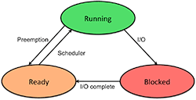
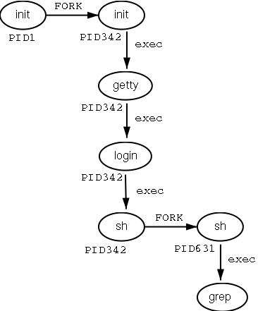

Processes

**What is a process?**

A *process *is an *executing* instance of a program. Processes are also frequently referred to as tasks. An executable file is a *binary file* (i.e., a file at least part of which is not *plain text*) that has been compiled from source code into machine code, which is a pattern of bytes that can be read directly by a CPU. Processes use the same *logical address space (virtual memory)* as the parent and runs identical code, however it has a different physical address space in memory.

Each process consists of *system resources* that are allocated to it, a section of memory, and security attributes (such as its *owner* and its set of *permissions*) and the processor *state*.

* The processor state includes the contents of its *registers* and physical memory *addresses*.

*  Registers are a very small amount of very fast memory that is built into a processor in order to speed up its operations by providing quick access to commonly used values. A memory address is a location in memory. 

Linux and other Unix-like operating systems have been designed from the ground up as complete time sharing systems, that is, as both *multitasking *and *multi-user* systems.

* A multitasking system is one that allows multiple processes to operate seemingly simultaneously without interfering with each other.

* a *multi-user* system allows multiple users to use the system simultaneously.

During its lifetime, a process will utilize a variety of system resources

1. A processor to run its instructions

2. The memory to hold it and its data

3. Files within the filesystem

4. Physical devices on the system

**Daemons**

Daemons are a class of processes that run continously in the background, rather than under the direct control of a user. The term is derived from the ancient Greek word *daimon,* which refers to a supernatural being that is intermediate between a human and a god. 

Process states

**Process Creation**

**Old Way**

When a process is created it is almost identical to its parent; same logical address space as the parent and runs the identical code, however it has a different physical address space in memory.

* Executes the same code as the parent, beginning at the next instruction after the process creation system call (fork()).

* In most cases this was inefficient as the fork() would almost always be followed with an execve() which wipes out whatever was there in the first place (Address space in memory)

**Fork**

While a process is running, it can *spawn* other processes. Spawning is accomplished through the use of a *system call* termed **_fork_** (because it splits in two). System calls are clearly defined, direct entry points into the kernel through processes request *services* from the kernel.

Steps in spawning a new process

1. An existing process creates an identical copy of itself

2. The copy is then transformed into the new process

**Syscalls**

* vfork() is an obsolete optimization. Before good memory management, fork() made a full copy of the parent's memory, so it was pretty expensive. since in many cases a fork() was followed by exec(), which discards the current memory map and creates a new one, it was a needless expense. Nowadays, fork() doesn't copy the memory; it's simply set as "copy on write", so fork()+exec() is just as efficient as vfork()+exec().

* clone() is the syscall used by fork(). with some parameters, it creates a new process, with others, it creates a thread. the difference between them is just which data structures (memory space, processor state, stack, PID, open files, etc) are shared or not.

**Copy on Write**

Used instead of fork() and execve() combination. Allows both the child and parent to read the same physical pages. When either tries to write on a physical page, the kernel copies its contents into a new physical page assigned to the writing process. A physical page is a fixed-length contiguous block of virtual memory, described by a single entry in the page table.

With this technique, when a fork occurs, the parent process's pages are not copied for the child process. Instead, the pages are shared between the child and the parent process. Whenever a process (parent or child) modifies a page, a separate copy of that particular page alone is made for that process (parent or child) which performed the modification. This process will then use the newly copied page rather than the shared one in all future references. The other process (the one which did not modify the shared page) continues to use the original copy of the page (which is now no longer shared). This technique is called copy-on-write since the page is copied when some process writes to it.

**Lightweight processes (LWP)(threads)**

* Created via the clone() syscall.

* Fn (Parameter for clone())

    * Specifies a function to be executed by the new process; when the function returns, the child terminates. The function returns an integer, which represents the exit code for the child process.

* Allow both the parent and child to share man per-process kernel data structures such as the paging table.

    * Page table is a data structure used by a virtual memory system to store the mapping between virtual addresses and physical addresses. 

        * Virtual addresses are used by the accessing process

        * Physical addresses are used by the hardware (RAM subsystem)

    * [https://en.wikipedia.org/wiki/Page_table](https://en.wikipedia.org/wiki/Page_table)

* The main use of clone() is to implement threads; multiple threads of control in a program that run concurrently in a shared memory space

* Adds better support for multi-threaded applications

* Two lightweight processes share some resources

* When one of the process makes a change tos hared resource the other preocess see the change immediately.

**Multi-threaded applications**

Processes are composed of several threads. Each thread represents an execution flow of the process.

* Thread

    * Flow of execution of the process. Processes containing multiple execution flows are considered a multi-threaded application

    * Determine if a process is multi-threaded

        * **ps -o nlwp <pid>**

        * **/proc/<pid>/tasks**

        * **/proc/<pid>/status**

    * Most multi-threaded applications are written using standard library function called pthread (POSIX Thread)

    * Native POSIX Thread library (NTPL)

        * #include <pthread.h>

Traditionally linux only supported userland threads only. This meant that even multi-threaded applications were viewed as a single process to the kernel.

**Destroying a process**

Process termination is typically invoked by the exit() system call. To determine the exit code in bash run: `echo $?`. Success codes are traditionally 0 where failures are some positive integer value. 

**Process removal**

The parent process waits to read the exit code from the child process. This is done via the wait() system call. Once the parent process reads the child's exit code the process is removed from the process table.  A zombie process is a process that has completed execution via the exit() call  but still lives in the process table. This happens when the parent process still needs to read the child’s exit code via the wait() system call.

